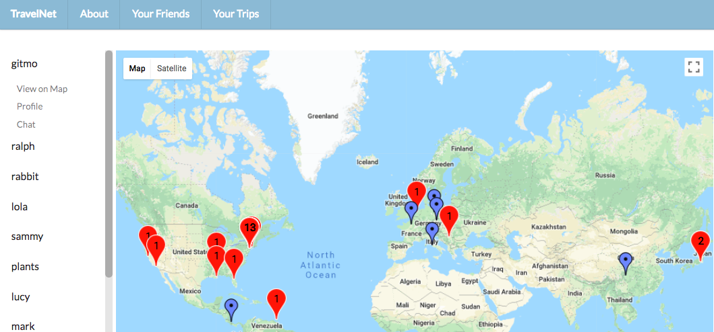

# Travel Net 
A social network for those with wanderlust to stay in touch with friends both traveling and at home. Ruby on Rails backend, JavaScript/React frontend, Redux for state management and Websockets.

[Travel Net Demo](https://youtu.be/ueo8LW80Z9c)

## How To Use
* Search for friends to add, await a friend response
* Your friends will be listed on the left side of the screen 
* Click on a friend listed to select their profile, chat window, or see where they are on the map
* Your friends traveling will appear on the map as blue markers 
* Your friends not currently traveling will appear on the map as red markers 
* Go on a trip, and add locations as you travel to keep your friends up to date with where you are 
* Add pictures to your trips 
* End a trip at any time, and put in where you've decided to take residence

## Prerequisites

* Ruby v5.1.4
* PostgreSQL 10
* React

## Install
1. Clone this repo - https://github.com/brianabaker/travel-net
2. Navigate to travel-net-backend, complete backend setup
3. In a separate terminal window, navigate to travel-net-frontend, complete frontend setup

## Backend Setup
After navigating to travel-net-backend, in that directory: 
1. Install Gems `bundle install`
2. Setup Database `rake db:create` then `rake db:migrate`
3. Start your server `rails s`

## Frontend Setup
After navigating to travel-net-frontend, in that directory: 
1. Install dependencies `yarn install` 
2. Start your server `yarn start` 

## In Your Browser 
Navigate to the web address of your Node server [http://localhost:3001](http://localhost:3001) - or whatever yours is

## Contributors 
* [Briana Baker](https://github.com/brianabaker)
